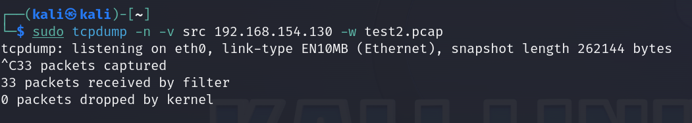

Most of the capture features in Wireshark are also available in TCPDump. You can specify an interface:
1. to capture from, 
2. apply traffic filtering 
3. and save the capture to a .pcap file. 

To *start a capture with default settings*, simply type the command **tcpdump**.  
To view the list of available interfaces that TCPDump can capture traffic on, use **tcpdump -D**. To start capturing on a specific interface, use **tcpdump -i** _interface_, e.g. **tcpdump -i en0**.

![[Pasted image 20240413130730.png]]

**Apply Traffic Filtering**
You can also apply filters by using command-line options:

1. To filter by source or destination host, use **tcpdump src** _ip-address_ or **tcpdump dst** _ip-address_
2. To filter by port, add the **port** parameter and the port number, such as **tcpdump dst port 25**.
3. To filter by protocol, add the protocol name, such as **tcpdump ftp**.
4. Also, just like Wireshark, logical operators such as **and** & **or** can be used to chain terms.
5. Lastly, to make TCPDump quit after capturing _x_ number of packets, use the **-c** _no._ option.

![[Pasted image 20240413132531.png]]

  
Sometimes, having addresses and ports resolved to names can be annoying if you are processing the capture file through a script or a series of commands to turn this off, use the **-n** option. 

**Saving PCAP Files**
Finally, you can save your capture to a PCAP file with **-w** _filename_.

<<<<<<< HEAD
![[Github/tcpdump/images/Pasted image 20240413133224.png]]
=======

>>>>>>> 67f797a7042f2bbc147dd6f00b1ea934d25c342c

